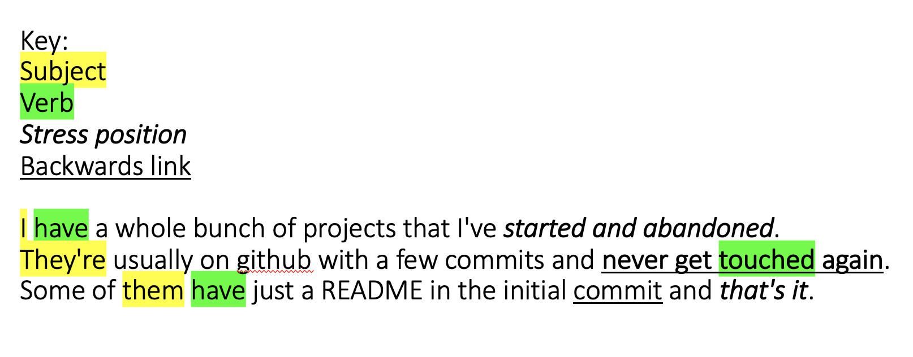
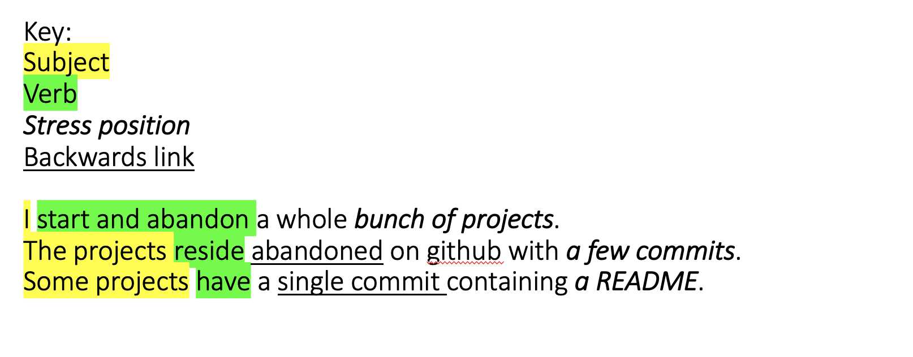

# sentfrag

Sentences should follow the same structure:
- Subject ~ Noun, usually at the beginning of the sentence
- Verb ~ Some action, usually right after the subject
- Stress position ~ The point of the sentence, usually at the end
- Backwards link ~ A link back to the previous sentence, can just be a repeated word or a synonym

Sentence 1: `Subject ... Verb ... Stress position`

Sentence 2: `Subject ... (backwards link) ... Verb ... Backwards link`

```
I have a whole bunch of projects that I've started and abandoned. 
They're usually on github with a few commits and never get touched again. 
Some of them have just a README in the initial commit and that's it.
```

```
I start and abandon a whole bunch of projects. 
The projects reside abandoned on github with a few commits. 
Some projects have a single commit containing a README.
```
# Before:


# After:
